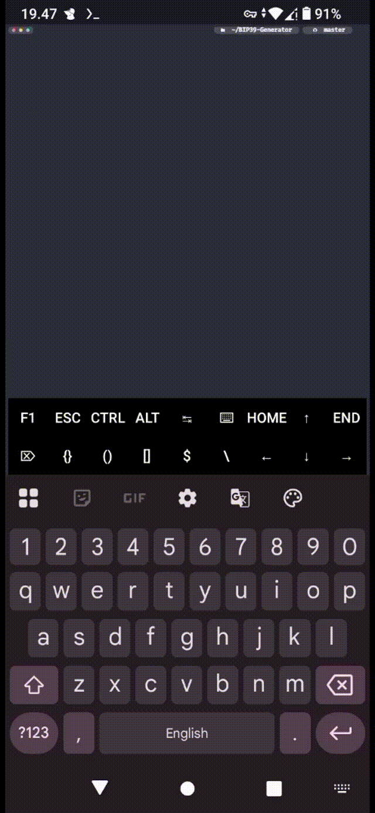

# BIP39 Generator

C++ offline mnemonic tool with embedded wordlist and SHA256.

Generates BIP-39 seed phrases (12 or 24 words) using CSPRNG via `/dev/urandom`. Compatible with Bitcoin, Ethereum, Binance, Solana, Litecoin, Tron, and most HD wallets. Everything runs fully offline.

---

## Demo




---

## Build

```bash
pkg update && pkg upgrade -y
pkg install g++ git make
git clone https://github.com/Rovikin/BIP39-Generator.git
cd BIP39-Generator
make
```

> **Catatan:** Flag `-O2` digunakan secara sengaja. `-O3` dihindari karena
> dapat mengeliminasi `volatile` zeroing yang membersihkan material entropi
> dari stack setelah setiap seed dibangkitkan.

Hapus binary dan object files:
```bash
make clean
```

---

## Usage

Generate 1 seed phrase (12 words, default):
```bash
./bip39
```

Generate 24-word seed phrase:
```bash
./bip39 --words 24
```

Generate multiple seed phrases:
```bash
./bip39 --count 5
```

Combine both:
```bash
./bip39 --words 24 --count 5
```

---

## Security

- Entropy source: `/dev/urandom` (CSPRNG)
- No network requests — fully air-gapped
- Embedded wordlist (BIP-39 standard, 2048 words)
- SHA256 checksum validation per BIP-39 spec

